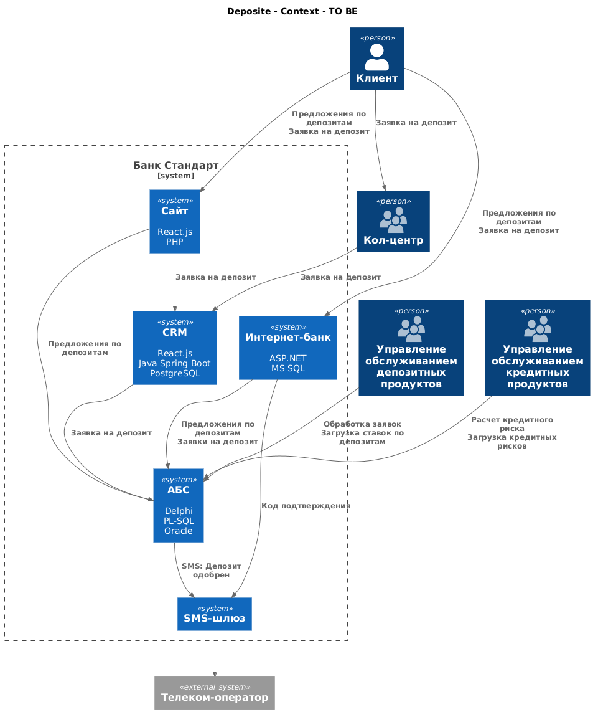
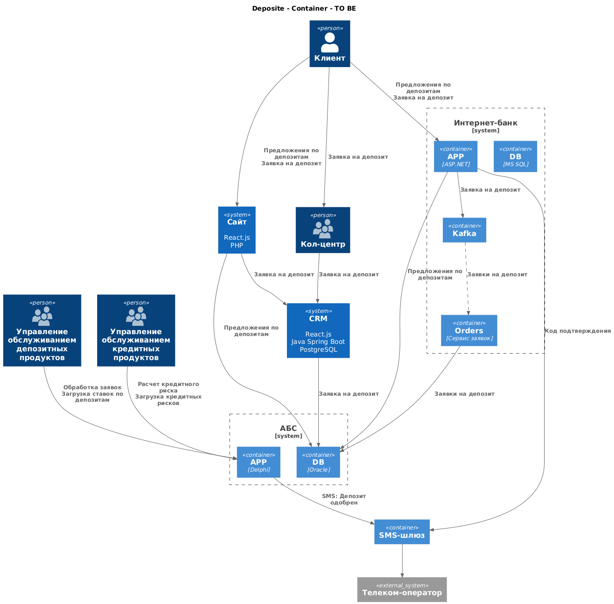

### **Название задачи:** Открытие депозитов онлайн
### **Автор:** Aydrus
### **Дата:** 01.01.2100
### **Функциональные требования**
Опишите здесь верхнеуровневые Use Cases. Их нужно оформить в виде таблицы с пошаговым описанием:

|**№**|**Действующие лица или системы**|**Use Case**|**Описание**|
| :-: | :- | :- | :- |
| UC1 | Клиент, Сайт | Предложения по депозитам | 1. Клиент заходит на сайт в раздел предложений по депозитам 2. Сайт запрашивает ставики по депозитам из АБС и отображает пользователю |
| UC2 | Клиент, Сайт | Оформление заявки | 1. Клиент выбирает ставку депозита и заполняет форму заявки с вводом ФИО 2. Заявка попадает в CRM |
| UC3 | Клиент, Интернет-банк | Предложения по депозитам  | 1. Клиент заходит в интернет-банк в раздел предложений по депозитам 2. Интернет-банк запрашивает ставики по депозитам и персональные ставки из АБС и отображает пользователю |
| UC4 | Клиент, Интернет-банк | Оформление заявки  | 1. Клиент выбирает ставку депозита и заполняет форму заявки с вводом ФИО 2. Клиент нажимает получить sms-код 3. Клиент вводит sms-код и отправляет форму 4. Заявка попадает в Kafka 5. Из Kafka сервис заявок отправляет заявки в АБС батчами каждый час |
| UC5 | Сотрудник кредита, АБС | Кредитные риски | 1. Сотрудники загружают кредитные риски прямо в АБС
| UC6 | Сотрудник депозита, АБС | Ставки по депозитам | 1. Сотрудники загружают ставки по депозитам прямо в АБС

### **Нефункциональные требования**
Опишите здесь нефункциональные требования и архитектурно значимые требования.

|**№**|**Требование**|
| :-: | :- |
| U1  | Интерфейс должен быть максимально удобным для клиента |
| U2  | Интерфейс должен придерживаться системы дизайна, принятой в компании |
| R1  | Развернуть Интернет-банк в кубере и использовать оба ЦОДа балансируя нагрузку между разными приложениями в этих кластерах |
| S2  | Предусмотреть разработку документации для дальнейшего расширения системы |
| +R1 | Необходимо везде использовать безопасный протокол https |

### **Решение**
Приведите диаграммы контекста и контейнеров в модели C4. Опишите там основные компоненты и интеграции всех элементов решения. 

Также опишите, какой логикой вы руководствовались в ходе принятия решений и выбора технологий. Не забывайте, что необходимо учесть все функциональные и нефункциональные требования.

Я допустил, что в CRM есть уже API, через которое можно добавить заявки, потому что это стандарт. И заявки с сайта попадают туда, потому что их обрабатывают менеджеры сперва.

Так как кол-цент банка и партера работают одинаково, то на схеме отобразил только один кол-центер.

### **Альтернативы**
Опишите здесь наиболее важные альтернативные решения.

- Лучше в отдельный сервис вынести систему по формированию ставок и возвращать ставки из этого сервиса
- Можно было бы заявки из базы интернет-банка мигрировать в базу АБС каждый день, как это с кредитным конвейером
  Но от этого легаси наоборот надо уходить
  Поэтому лучше заложиться сейчас на новый сервис с кафкой

**Недостатки, ограничения, риски**

Подробно опишите здесь недостатки, ограничения и риски выбранного решения.

- Получение персонализированные предложений через PL-SQL не лучшая идея
- АБС перегружен, нужен распил