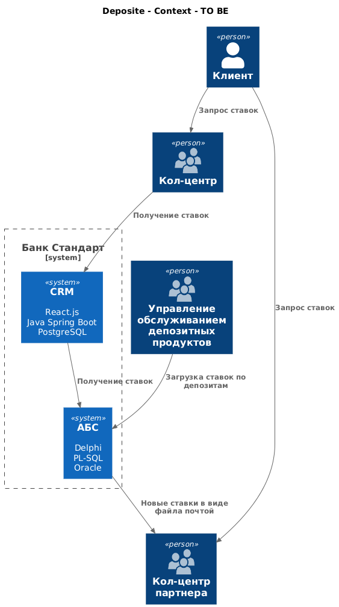
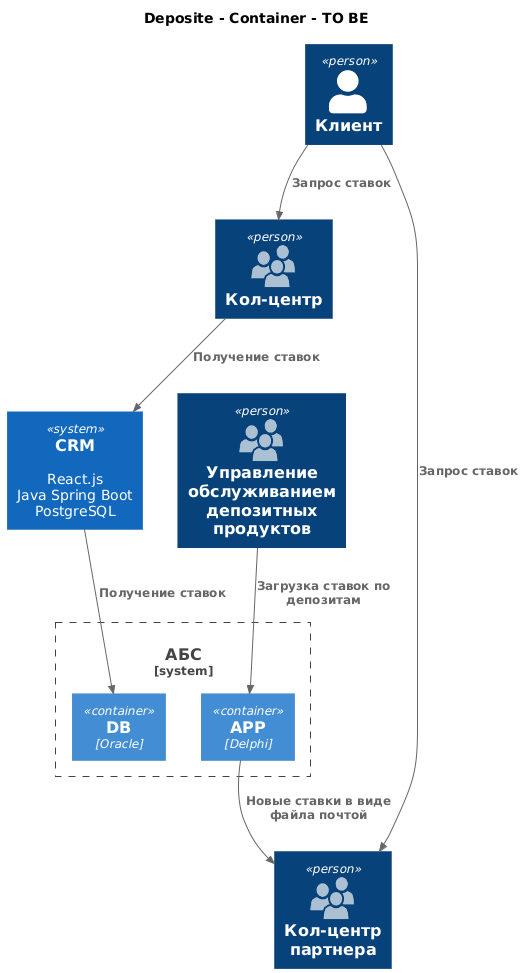

### **Название задачи:** Открытие депозитов онлайн
### **Автор:** Aydrus
### **Дата:** 01.01.2100
### **Функциональные требования**
Опишите здесь верхнеуровневые Use Cases. Их нужно оформить в виде таблицы с пошаговым описанием:

|**№**|**Действующие лица или системы**|**Use Case**|**Описание**|
| :-: | :- | :- | :- |
| UC1 | Клиент, Кол-центер банка | Предложения по депозитам | 1. Клиент звонит в кол-центер, чтобы узнать ставки 2. Сотрудник кол-центра банка синхронно запрашивает ставики по депозитам из АБС и озвучивает пользователю |
| UC2 | Сотрудик депозитов, АБС | Отправка ставок | 1. Сотрудник обновляет в системе ставки по депозитам 2. После сохранения изменений на почту партнера отправляется новый файл |
| UC2 | Клиент, Кол-центер партнера | Предложения по депозитам | 1. Партнер получил ставки по депозитам на почту в виде файла. 2. Клиент звонит в кол-центер, чтобы узнать ставки 3. Сотрудник кол-центра партнера смотрит ставки в файле и озвучивает пользователю |

### **Нефункциональные требования**
Опишите здесь нефункциональные требования и архитектурно значимые требования.

|**№**|**Требование**|
| :-: | :- |
| 1  | Новые ставки должны доходить до партнера максимально быстро |

### **Решение**
Приведите диаграммы контекста и контейнеров в модели C4. Опишите там основные компоненты и интеграции всех элементов решения. 

Также опишите, какой логикой вы руководствовались в ходе принятия решений и выбора технологий. Не забывайте, что необходимо учесть все функциональные и нефункциональные требования.

### **Альтернативы**
Опишите здесь наиболее важные альтернативные решения.

Надо бы создать единую систему, куда будут получать доступ все, кто работают со ставками

**Недостатки, ограничения, риски**

Подробно опишите здесь недостатки, ограничения и риски выбранного решения.

Сейчас нед единого способа получения ставок

Так же при работе с файлами может сработать человеческий фактор и сотрудним может не увидеть что письмо пришло, или не получит уведомление. Нужно синхронно запрашивать данные
