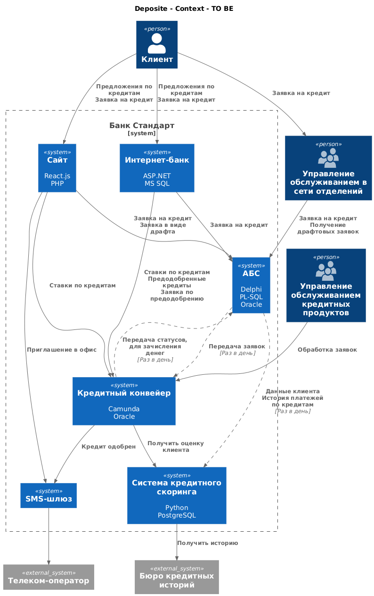
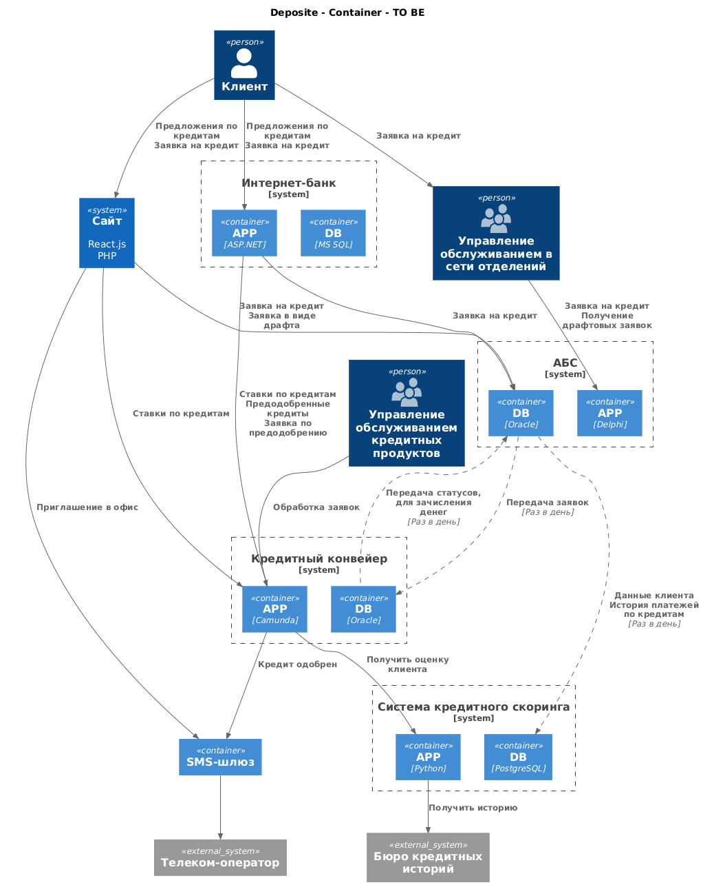

### **Название задачи:** 
### **Автор:**
### **Дата:**
### **Функциональные требования**
Опишите здесь верхнеуровневые Use Cases. Их нужно оформить в виде таблицы с пошаговым описанием:

|**№**|**Действующие лица или системы**|**Use Case**|**Описание**|
| :-: | :- | :- | :- |
| UC1 | Клиент, Сайт | Предложения по кредиту | 1. Клиент заходит на сайт в раздел кредитов 2. Сайт запрашивает ставики по кредитам из АБС и отображает пользователю |
| UC2 | Клиент, Сайт | Заявка без паспорта | 1. Клиент отправляет заявку без паспорта 2. Сайт отправляет заявку в АБС без паспорта в виде драфта 3. Клиенту отправляется сообщение, что нужно прийти в офис |
| UC3 | Клиент, Сайт | Заявка с паспортом | 1. Клиент отправляет заявку с паспортом 2. Сайт отправляет заявку в АБС 3. Заявка через некоторе время попадает в Кредитный конвейер 4. Сотрудник кредита одобряет кредит 5. Клиенту отправляетя смс сообщение, что кредит одобрен и нужно прийти в офис |
| UC4 | Клиент, Офис | Кредит по заявке | 1. Клиент приходит в офис для получения кредита 2. Сотрудник находит драфтовую заявку и заполняя паспортные данные отправляет заявку в АБС 3. Заявка через некоторе время попадает в Кредитный конвейер 4. Сотрудник кредита одобряет кредит 5. Клиенту отправляетя смс сообщение |
| UC5 | Клиент, Офис | Кредит без заявки | 1. Клиент приходит в офис для получения кредита 2. Сотрудник с нуля заводит заявку в АБС 3. Заявка через некоторе время попадает в Кредитный конвейер 4. Сотрудник кредита одобряет кредит используя информацию из скоринга клиента 5. Клиенту отправляетя смс сообщение |
| UC6 | Клиент, Интернет-банк | Предложения по кредиту | 1. Клиент заходит в интернет-банк в раздел кредитов 2. Интернет-банк запрашивает ставики по кредитам из АБС и отображает пользователю |
| UC7 | Клиент, Интернет-банк | Предодобренные кредиты | 1. Сотрудники кредитов периодически проводят процедуру предодобрения кредитов для надежных клиентов 2. Когорта клиентов достается из АБС и по ним создаются заявки на предодобрение кредитов  3. В свободное время кредиты предодобряются и попадают в АБС  4. Клиент заходит в интернет банк и видит предодобренные кредиты   5. Предодобренные кредиты достаются из Кредитного конвейера |
| UC8 | Клиент, Интернет-банк | Заявка с нуля | 1. Клиент выбирает кредит из предложений и оформляет заявку 2. Заявка попадает в АБС 3. Через некоторе время попадает в Кредитный конвейер 4. Сотрудник кредита одобряет кредит получая информацию из скоринга клиента 5. Клиенту отправляетя смс сообщение, что заявка одобрена и денги будут начислены в течении дня  6. Дальше когда происходит передача статусов на зачисление денег в АБС деньги начисляются |
| UC9 | Клиент, Интернет-банк | Заявка по предодобрению | 1. Клиент оформляет заявку по предодобренному кредиту 2. Заявка попадает сразу в Кредитный конвейер 3. Сотрудник кредита одобряет кредит получая информацию из скоринга клиента, только если что-то поменялось и это необходимо  4. Клиенту отправляетя смс сообщение, что заявка одобрена и денги будут начислены в течении дня  5. Дальше когда происходит передача статусов на зачисление денег в АБС деньги начисляются |

### **Нефункциональные требования**
Опишите здесь нефункциональные требования и архитектурно значимые требования.

|**№**|**Требование**|
| :-: | :- |
| U1  | Интерфейс должен быть максимально удобным для клиента |
| U2  | Интерфейс должен придерживаться системы дизайна, принятой в компании |
| S2  | Предусмотреть разработку документации для дальнейшего расширения системы |
| +R1 | Необходимо везде использовать безопасный протокол https |

### **Решение**
Приведите диаграммы контекста и контейнеров в модели C4. Опишите там основные компоненты и интеграции всех элементов решения. 

Также опишите, какой логикой вы руководствовались в ходе принятия решений и выбора технологий. Не забывайте, что необходимо учесть все функциональные и нефункциональные требования.

Я решил заявки по предодобренным кредитам сразу отправлять в конвейре, потому что в таком случае два дня, которые тратились чтобы сначала из АБС отправить в конвейер а потом обратно, сократятся до одного.

Сотрудник сам решаем обращаться ли к скорингу исходя из данных из которых был предодобрен кредит. Если ничего не поменялось, то и перезапрашивать данные не нужно.

Так как кол-цент банка и партера работают одинаково, то на схеме отобразил только один кол-центер.

### **Альтернативы**
Опишите здесь наиболее важные альтернативные решения.

Лучше переписать архитектуру и использвать Kafka для передачи данных между АБС и конвейром и скором.
Так же лучше все заявки хранить в отдельном сервисе, не смешивая с хранилищем данных.

**Недостатки, ограничения, риски**

Подробно опишите здесь недостатки, ограничения и риски выбранного решения.

Заявки разбросаны по системе, обменн данным через бд дичь какая-то, получение персонализированные 
